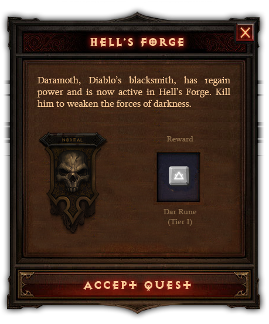
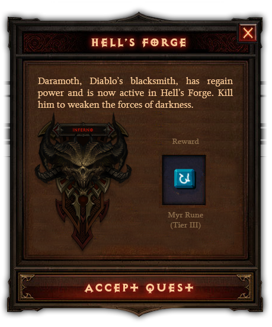
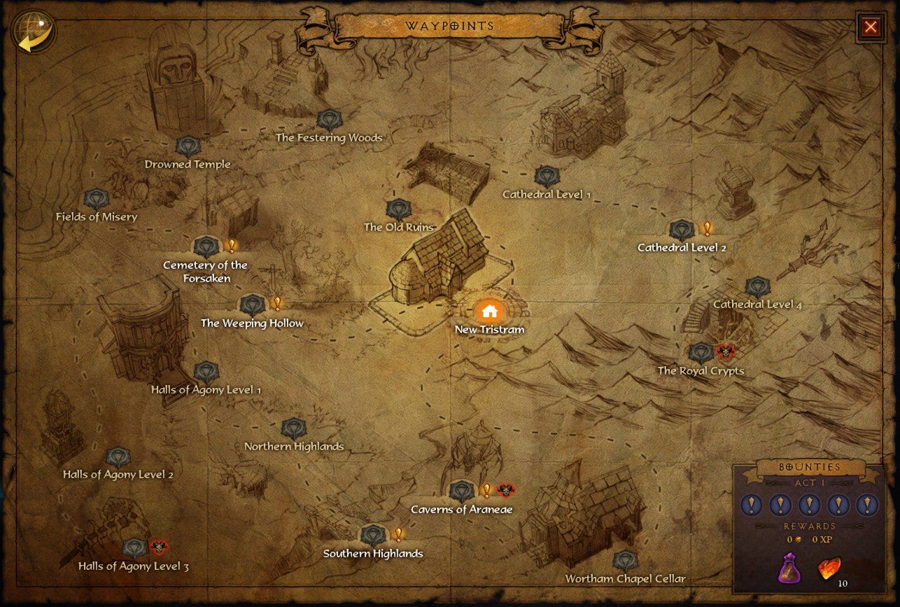

    

        <h1>Diablo IV Wishlist</h1>
        

            

                
After the complete disaster for diablo fans at Blizzcon, here is my take on what should be implemented
                    in Diablo 4. I don't have any doubts on the quality Blizzard will be delivering but this is a very personnal
                    list I'm making. I know many of you will disagree and say that Diablo II was the best game ever made.
                    That it was perfet in every way... etc. The fact is, I think Diablo III was a better game. Even though
                    my reasons for loving this game are not related to end game content, here is a quick list of why I personnally
                    think Diablo III was better.
                    <ol>
                        <li>
                            The fact that if you made a mistake in a skill placement, you can go back and actually say: "Never mind. That skill blows.".
                            It's something that you could not do in Diablo II. Your whole hero build had to be decided from
                            level 2. Made a misclick at level 31? Just too bad buddy. Start over.
                        </li>
                        <li>
                            Diablo III has better loot. Period. I spent hours and hours and hours doing Mephisto runs in Hell difficulty. I never got
                            more than a Stormshield. I never saw a Zod, Vex, Ber rune. I never dropped a single SOJ. I do
                            agree that loot in Diablo III is the complete opposite. There is no item I never dropped in Diablo
                            III. Again, maybe the 3 000 hours I spent on it might be a reason. When you think about it, a
                            game that dosent provide you with items you need after that amount of time spent on it is quite
                            frustrating.
                        </li>
                        <li>
                            Adventure Mode and Story Mode. The fact that quests are not required to be farming across all acts is a must.
                        </li>
                        <li>
                            Difficulty. Thing is, neither games got the difficulty i would wish for. I used to have it in Diablo III. But since Greater
                            Rifts, it's just not what I would have prefered. There was this nice climb to make, normal to
                            hard, expert, master and then... Torment. The six degrees of Torment were perfect. To be able
                            to farm at Torment IV, you'd have to get prime gear and a kick-ass build. Now it's just, get
                            a six pieces set, Torment IIX.
                        </li>
                    </ol>
                

                <h2>IEnd Game Content</h2>
                  
                
It's not the first item on the list for nothing. I have countless hours of Diablo III gameplay and I will
                    not be getting into Diablo II hours... The thing that both of those titles were missing is; End. Game.
                    Content. While playing Diablo III recently and being bored to death, I started asking myself: "What are
                    the games or concept that kept me playing a game, even though it's been several hundred hours?". The
                    answer is quite simple.
                       There is only two ways to make a game last this long. 
                

                <ol>
                    <li>
                        Either you constantly keep new content comming (Guild Wars, Pay Day 2, Path of Exile)
                    </li>
                    <li>
                        Or you make it endless, like a game of chess. (League of Legends, Dota 2, Starcraft etc...)
                    </li>
                </ol>
                 
                

                    Now, I KNOW! We can't have Diablo MOBA. So the only option left is new content. And in this case, new end game content. In
                    Guild Wars, I've played for over 1 500 hours. And there are AT LEAST 10 dungeons I didn't even saw the
                    end of. The fact is, it was so hard to get through, we weren't strong enought to make it. Main reason
                    was, we needed to be a group of human beings, like most MMORPG, to suceed. Thing is, we were not. We
                    ended up using NPC and it always blew. But the rare times we could get a party of 8 real people, it would
                    be awesomly hard.
                

                 
                

                    So, in conclusion, I'd had special dungeons with special reward. Loot of course, but special weapons and armor skins. Special
                    pets or recalling animations. It could go as far as having a second story, only accessible when all difficulty
                    have been cleared. A list of bounties on demons and angels. Or the quest to craft something so long to
                    craft that it would take hours. The list of things we CAN do should be much longer than the CAN'T do.
                

                <h2>IIRunewords</h2>
                

                    Another thing that i wish so much to get back is runewords. The way they worked in Diablo II made it so hard to get that
                    it wasen't even an option but with the Diablo III loot system, it made sense. Crafting runes would be
                    an option. Back in Diablo II, you could merge smaller runes to make greater ones. It had an end, which
                    I would remove and juste make it longer to acheive. So when you would actually craft the one last bit
                    you needed for that runeword, it would be so satisfying.
                

                 
                

                    Another way could be as a reward from a specific dungeon; the higher the rune, the harder the dungeon. It would be relative
                    to the difficulty you are at. This would mean, "oh I want to craft Undead Breath, I need that rune, so
                    I need to go do that dungeon, then this one and then craft it."

                     
                      With these two methods, any player could acheive any runeword.
                

                
                
                <h2>IIIREAL Dungeons</h2>
                

                    What I mean by real dungeons is a defined place, with a defined route and an end boss. Let's make an example.
                     
                     
                    
                     
                     Let's assume that Royal Crypts is a Dungeon. So you have to enter adventure mode (or dungeon mode),
                    and go there. Upon entering the dungeon, you are prompted with an actual quest for that specific dungeon.
                    The difficulty you are on affects the reward and the actual difficulty of course. But every dungeon would
                    be harder or easier REGARDLESS of the difficulty.
                     
                      For example, Royal Crypt is an easy dungeon. So, in Inferno VI, it's still an 'easy' dungeon. Which means that if you can clear Inferno VI 
                    fairly easily, this dungeon will be possible for you. On the other hand, doind Hell's Forge in Inferno IV require gear, build AND technique.
                     
                     
                    This would make the game harder to beat for someone who just... farm. You need to actually have technique. Know what you are doing. If you don't then you will no be able to clear the dungeon. 
                    Here is how I think dungeons should be handled:
                    <ol></ol>
                

                <h2>IVPvP Modes</h2>
                <h2>VGet rid of Trifecta</h2>
            

        

    

    <!-- Optional JavaScript -->
    <!-- jQuery first, then Popper.js, then Bootstrap JS -->
    
    
    

